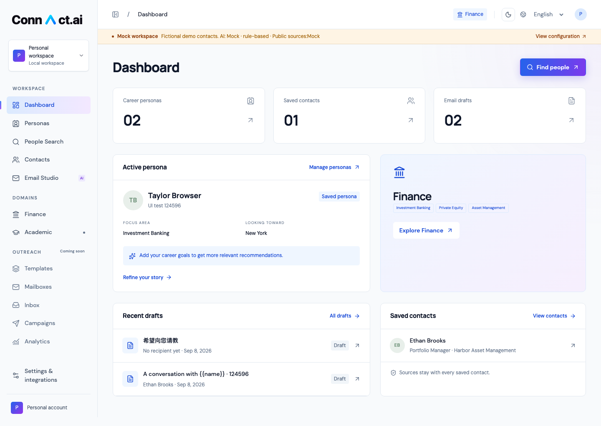
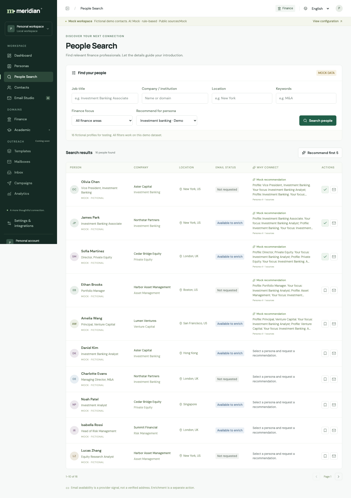
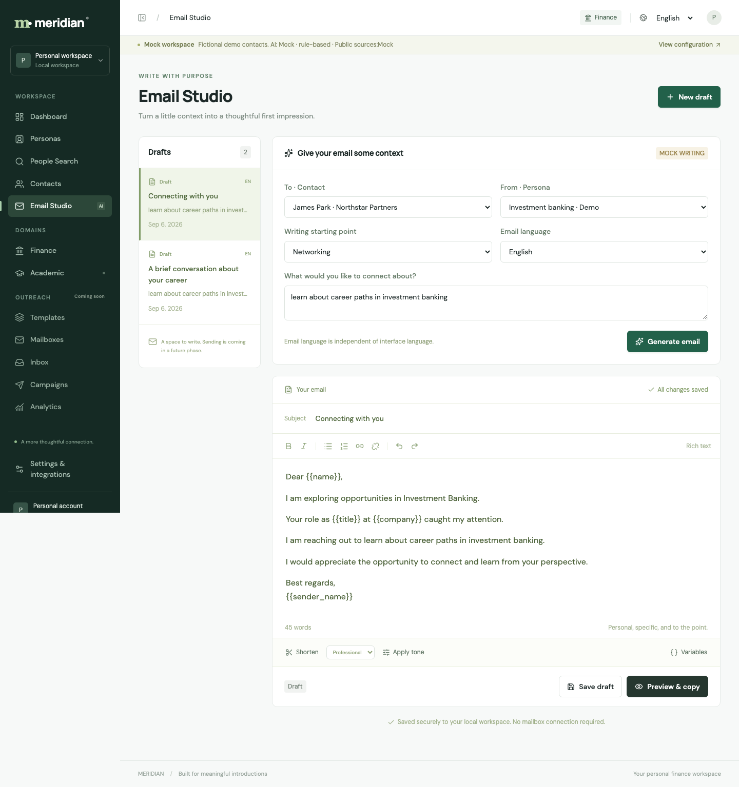

# MVP Validation Record

This record distinguishes actual runtime results, contract testing, and unverified sections. Older dated results are retained as history; the latest section supersedes their provider and deployment status.

## 2026-09-09: Recover the login page after a Render cold start

- Captured live frontend `/api/auth/session` and `/api/health` responses with HTTP 502 and an HTML body while direct backend requests timed out. Render logs recorded backend startup at 10:00 GMT+8. The previous client attempted to parse this HTML as JSON, surfacing a browser parser error on the login card.
- After startup, frontend and backend session/health endpoints returned HTTP 200 JSON, including `database: postgresql`. A fresh browser displayed the login form, and an existing signed-in browser opened its workspace. Unauthenticated `/api/config` remained HTTP 401; an unapproved Origin remained HTTP 403.
- The client now handles non-JSON responses without exposing browser parser errors. Session reads retry transient failures up to five times after the initial request, with a 15-second request timeout and about 2.5 minutes total maximum wait. Retries can be restarted manually and are cancelled on unmount. Login, registration and other writes are never automatically retried.
- Production Next.js build and TypeScript passed. Both isolated real-backend browser flows passed: invitation registration/login/logout with workspace isolation, and open registration with administrator access controls and original-file inspection. All test accounts and files were confined to disposable local databases.
- Nine controlled failure/recovery scenarios passed against the production build in both Chromium and mobile WebKit (18 checks): HTML 502, HTML 200, invalid session JSON, network failure, stalled-request timeout, retry exhaustion/manual recovery, cancellation of a pending retry, a single failed login POST with its server detail preserved, and no recursive session reads on HTTP 401. Mobile recovery screenshots were visually reviewed. These controlled responses are regression evidence, separate from the live endpoint checks above.
- The free Render services still sleep when idle. This repair handles recovery in the client; it does not establish an always-on hosting guarantee or verify live AI/search providers.

## 2026-09-08: Persistent people retrieval, Sequence-style writing and invitation trial

- Final full backend suite: **64 passed on a temporary independent PostgreSQL database**. SQLite suite: 63 passed and one PostgreSQL-only concurrency test skipped.
- Browser checks: **8 passed** for the isolated Mock workflow/writing suite, **1 passed** for invitation registration/login/logout and cross-account isolation, and **2 passed** for people-state recovery and stale callbacks.
- TypeScript, production Next.js build, migrations and `alembic check` passed. Production frontend is serving at `127.0.0.1:3100` against the existing PostgreSQL backend.
- Live providers: SerpAPI returned 10 LinkedIn search results; Apify returned five work and three education entries in a sample profile, and a separate business email in one of two email trials. Total Apify trial cost was $0.024. Apollo still returns `403 API_INACCESSIBLE`.
- Bailian Qwen Plus/Turbo/Max each returned HTTP 200; full asynchronous writing and PDF parsing/deduplication were live-verified. Production UI generation, explicit insertion and refresh persistence passed with an independent draft.
- Both Docker images built. Isolated containers verified frontend HTML/JS/brand resources and writable cache, backend upload-volume permissions, SQLite migration/health/draft creation, and invitation/origin guards. Compose configuration passed; the complete Compose PostgreSQL stack and public TLS deployment were not run.
- No email was sent. Gmail OAuth and public server deployment remain outstanding. See [current delivery report](customer-ready-2026-09-08.md), [provider evidence](people-provider-verification.md), and [customer trial operations](customer-trial.md).

## 2026-09-07: Google discovery → Apollo email matching

This update supersedes the provider status in the original 2026-09-06 report below.

- Local `.env`: people search and public sources are Live, with both supplied keys configured; AI remains Mock. Keys are excluded from Git and the local configuration is permission 600.
- Live SerpAPI: HTTP 200 for `site:linkedin.com/in/ Investment Banking Goldman Sachs New York`; 9 unique person profiles returned, stored under SerpAPI with canonical LinkedIn URLs and Google source evidence. Google result totals are explicitly estimated.
- Live Apollo: requested `/api/v1/people/match` using a discovered LinkedIn URL. Both the initial JSON request and the documented query-parameter format returned HTTP 403, `API_INACCESSIBLE`. Provider message explicitly states this account's Free plan does not include the endpoint. The final adapter uses the documented query-parameter format. **No real email was retrieved.**
- Browser check: Next.js → FastAPI → PostgreSQL → SerpAPI returned 9 people; the selected person's URL was present in the drawer; Apollo's permission error appeared after clicking “Match with Apollo & get email”; results remained visible; no browser page errors. Screenshots are in local ignored `work/live-google-search.png` and `work/live-apollo-permission.png`.
- Regression tests: successful matching on the same Contact, separate source attribution, enrichment cache, identity/edit invalidation, mismatched/missing LinkedIn URL rejection, empty-email/no-person outcomes, duplicate/spoofed URL filtering, pagination, missing keys, additional public-source lookup, and Apollo permission errors are covered with controlled HTTP responses. These tests do not prove live account email coverage.
- Final PostgreSQL test suite: 29 passed. TypeScript and production build passed. Original Mock workflow tests remain in the suite; test configuration now explicitly excludes all real API keys.

Remaining external requirement: enable `people/match` access in the Apollo account and retry email enrichment. Search already works with SerpAPI alone; enrichment failures do not fall back to Mock or cache a successful result.

## Actual Runtime Environment

- macOS ARM64, Node.js 26.7.0, Python 3.12.14.
- Next.js 16.3.4 / React 19.2.4 / Tiptap 3.31.3.
- FastAPI 0.135.1, SQLAlchemy 2.0.48, Alembic 1.18.4.
- **Real PostgreSQL 18.4**, development instance within the project, bound to `127.0.0.1:54329`.
- Application workspace `local-personal`; server-side testing uses an independent `meridian_test` PostgreSQL database.
- All three third-party services are explicitly set to Mock; browser flow still proceeds through Next.js → FastAPI → PostgreSQL.

## Results

| Check | Result | Actual Coverage |
| --- | --- | --- |
| PostgreSQL Migration | Passed | Alembic initial migration upgrade succeeded, `alembic check` no structural drift; attached `schema.sql` |
| Server-side Testing | **15 passed** | Full business flow, independent workspace, persona version, duplicate save, pagination, limits, errors, draft lock, parsing and variables |
| Browser Testing | **4 passed** | Chromium executed full form, search, save, edit, preview, copy, and refresh operations |
| TypeScript / Production Build | Passed | `npm run typecheck` and `npm run build`; no type or compilation errors |
| Application Health | Passed | `/api/health` returns `status=ok, database=postgresql`; frontend HTTP 200 |
| Full-stack Restart and Persistence | Passed | After stopping Next.js, FastAPI, and PostgreSQL, restarted with `SEED_DEMO=1 ./scripts/dev.sh`; all record IDs of 1 persona / 3 contacts / 2 drafts were fully retained |
| Demo Data Idempotency | Passed | Re-executing seed on restart prompted existence, no duplicate data created |
| Desktop and Mobile Layout | Passed | 1440×1000 and 390×844 screenshots; mobile page has no horizontal overflow, tables scroll horizontally internally |

## Completion Criteria Mapping

1. **Persona**: Manually created and modified, then refreshed to read; DOCX uploaded in browser, text PDF extracted on server side; name, education, skills, etc., fields match the file. Scanned/No-text PDF, illegal types, and damaged PDF return clear failure.
2. **Search and Recommendations**: 16 fictional people filtered by job, company, region, keyword, and field with pagination. Recommendations are constructed from the selected persona's exact targets and known fields while retaining the source ID and persona version.
3. **Save Contact**: Still exists after refresh; saving again shows already saved. Re-search reuses provider ID, no new contact created.
4. **Email Editing**: Enter editor from contact drawer, generate email with variables, manually modify subject and body. Separate validation for Chinese generation, and bold content saved and re-opened.
5. **Preview and Copy**: Replace recipient name, organization, and sender name with real database fields. Test read browser clipboard, confirming it contains final contact name. When variables are missing or unknown, the review button is unavailable, and the server also rejects.
6. **Full Mock**: Interface navbar, search row, recommendations, and generated content show Mock; fictional emails use `.example`. The entire flow does not call third-party APIs.
7. **Real Adapter**: Apollo parameters, restricted name/email, HTTP 403; SerpAPI links and up to three results; AI JSON format and error responses have isolated contract testing. No real keys, no real provider requests executed.
8. **Future Entrypoints**: Academic, Templates, Mailboxes, Inbox, Campaigns, Analytics, Settings all have usage descriptions and Coming Soon. Academic has no mentor data generated; Gmail shows not connected, no send success status.

## Special Verified Save Behavior

- Two PostgreSQL requests using the same draft version saved simultaneously: one 200, one 409; no silent override.
- Simulated a slow network request, changed the subject and body before the first save completed, then navigated away: the latest content was queued for saving and fully retained when the draft was reopened.
- Browser network request interrupted: shows Save failed, edit buffer still retained; recover network, click Retry save, then successfully persisted.
- Modify persona or contact: associated draft exits Reviewed state, increases version, requires re-check.
- Fix issue where Tiptap switching to read-only state accidentally triggered update; switching to read-only state does not reset review state.

## Unverified and Edge Cases

- **Apollo / SerpAPI / Live AI: No end-to-end live-account verification was performed.** Contract tests use controlled HTTP responses and therefore cannot prove account permissions, live data coverage, or costs.
- **Docker Compose: Configuration provided, current machine has no Docker, no actual container build/run.** Compose uses PostgreSQL 16; current actual verified local PostgreSQL is 18.4. Migration uses standard JSON, foreign keys, unique indexes, and row locks, no PostgreSQL 18-specific syntax.
- Single-user mode locally does not provide authentication and authorization required for public deployment.
- Mock resume field extraction depends on section titles; scanned documents do not do OCR, complex layouts may require manual completion.
- Recommendation selection and external service calls are executed synchronously, with per-call and per-minute limits, no multi-user stress testing done.
- Third-party dependency test client produces 2 deprecation warnings; tests passed, no impact on current runtime.

## Preview Screenshots

Mobile screenshot see [mobile.png](mobile.png). Screenshot uses fictional seed data, not representing real financial professionals.
